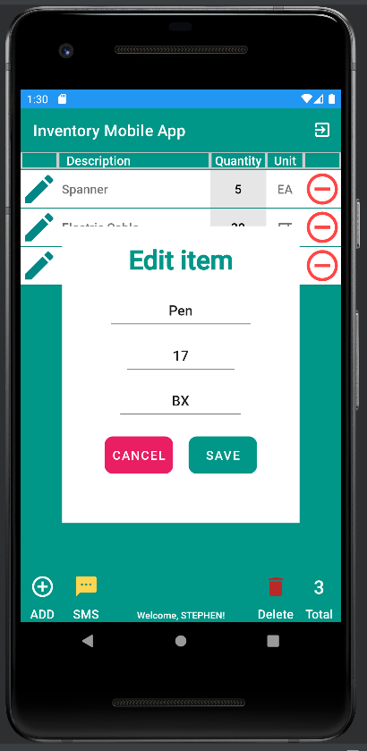

 
 
 
 

---

## Inventory Mobile App - Android Mobile Application CS360 Mobile Architecture and Programming Algorithm and Data Structures: Category (Two)

---

The Inventory app revolutionizes stock management by harnessing the power of mobile devices. Whether it's tracking items in a warehouse or facilitating seamless order fulfillment, this app streamlines inventory logistics, propelling businesses towards growth and efficiency. Developed in JAVA for Android devices, the app ensures widespread accessibility. By targeting a minimum Android SDK API 16 (Jelly Bean), it caters to a vast array of devices, maximizing reach and usability.

Collaboration lies at the heart of our development process. Engaging with fellow developers, we tackle programming challenges and integrate design elements seamlessly. This collaborative spirit enhances the app's quality and fosters a dynamic learning environment.Coding this app has been a rewarding journey. Working alongside a talented team, we transform ideas into reality, leveraging each other's strengths to drive innovation. Together, we unlock the full potential of our concepts, propelling them towards success and growth.

    
    
<em>Figure 1 - Edit Item Dialog Screenshot</em>

In developing the JAVA code, I meticulously employed industry-standard best practices and techniques. This included incorporating in-line comments, adhering to appropriate naming conventions, and ensuring consistent formatting and indentation. By following these practices, I aimed to enhance the readability and organization of the application's codebase. I named JAVA class files using camelCase CapWords and employed lowercase names for layout files, maintaining consistency and clarity. Global variables were named with camelCase CapWords, while variables scoped within class methods followed either camelCase or lower case dash_names conventions.

In naming class methods, I made sure to reflect their purpose and action, thereby facilitating code comprehension and maintenance. Methods that overridden superclass methods were named in camelCase with an initial lowercase word, while those that did not were named using camelCase CapWords. Throughout the code, I included comment statements to succinctly summarize the functionality of classes and methods, providing valuable guidance for developers. By adhering to these rigorous coding standards, I aimed to create a codebase that is both comprehensible and maintainable, fostering efficient development and collaboration.

    
    
<em>Figure 2 - Sign in Activity Screenshot</em>

The inclusion of name and email as part of the user's login credentials, along with the phone number for password recovery, exemplifies our commitment to a zero-trust ethic and underscores our security-centric approach throughout the development process. By anticipating potential adversarial exploits in software architecture and designs, we proactively mitigate design flaws and ensure the privacy and enhanced security of data and resources.

We integrate security measures from the inception phase through product assurance, testing, and compatibility checks across the entire software development life cycle. Secure coding standards tailored to the target development language and platform are meticulously applied to fortify the application against security threats and vulnerabilities.

    
    
<em>Figure 3 - Account Creation Screenshot</em>

In designing the components for the mobile app within the Android Studio IDE, I effectively showcase my proficiency in comprehending the relationships among activities and their elements, seamlessly integrating them into the programmatic phase of the mobile application. Guided by mobile development principles and industry standards, I leverage user-centered design principles to ensure intuitive and user-friendly experiences.

Prior to the application launch, I conduct security assessments, product assurance evaluations, and compatibility checks to uphold the app's integrity and functionality across various devices and environments. This meticulous approach underscores my commitment to delivering high-quality, reliable mobile solutions that meet user expectations and industry standards.

---

Artifact enhancement files repository at [CS360 Mobile Architecture and Programming](https://github.com/kowustep8719/kowustep8719.github.io/enhancement/CS360-algorithm "Inventory Mobile App - Repository")

---

    <a href="#top">
        <button style="font-size: 10px; font-weight: 500; background: #90ee90; color: #ffffff; border-radius: 50px; border-style: solid; border-color: #90ee90; padding: 5px 8px;">Back to Top &#8593;</button>
    </a>

<!-- Anchor element placed at the top of the page -->

