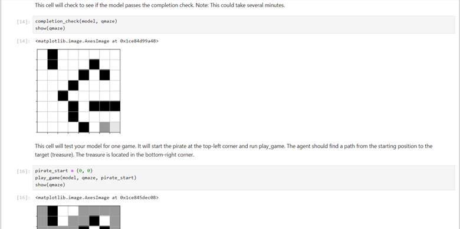
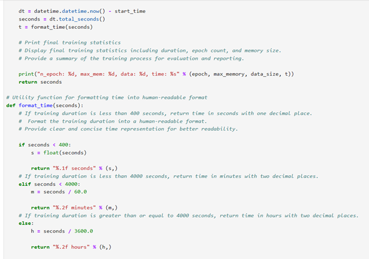

   

---

## Treasure Hunt Maze CS370 Current and Emerging Trends in Computor Science Software Engineering and Design Category (One)

---

Overseeing the Treasure Hunt game involves managing two main things: controlling the maze exploration and tracking the treasure hunter's progress. I developed an algorithm and comprehensive guide to ensure individuals can effectively navigate the maze and monitor their advancement. Additionally, I've expanded this program to observe how the Intelligent Agent maneuvers through the maze and interacts with its environment. At the core of the Treasure Hunt game lies the maze itself, where all the action unfolds. I've curated a maze that offers both challenge and enjoyment for the Intelligent Agent to explore. I established clear guidelines for movement and added challenges and prizes to keep participants interested throughout.

The GameExperience functionality records and retains the Intelligent Agent's complete experiences, helping it along its path. I have made sure that this function works without a hitch, recording the activities of the Intelligent Agent and making it easier to comprehend how it develops. The train function helps the Intelligent Agent make decisions as it moves through the maze and helps guide it. I've adjusted this feature to strike a balance between exploration and game completion, changing it on the fly to keep things exciting.

    
    
<em>Figure 1 - Treasure Maze Navigation Environment</em>

The artifact concerns Treasure Hunt Game: Human Brain and Artificial Neural Network. I created deep Q-learning algorithms to build a model that trains agents to move through the maze to find the treasure. When the code is run, it will start the pirate at the top-left corner and play the game. Some blocks on the maze can prevent the pirate or the agent from moving through. The treasure is located in the bottom-right corner, and the agent should find a path from the starting position to the treasure.

Developing the maze navigation path involves various software design and engineering aspects, including problem-solving, system architecture, modularity, testing, optimization, user experience design, and documentation. Additionally, the code demonstrates how to create a Q-learning-based labyrinth navigation system that is well-organized, manageable, and efficient. These guidelines aid in the creation of reliable, adaptable, and simple-to-comprehend and manage software systems. 

Adding clear and concise comments throughout the codebase ensures that the purpose, functionality, and decision-making processes are well-documented. This helps us achieve one of the five computer science outcomes: "Design, develop, and deliver professional-quality oral, written, and visual communications that are coherent, technically sound, and appropriately adapted to specific audiences and contexts." This makes the code coherent and accessible to other developers or stakeholders, meeting the outcome of professional-quality communications. Also, I ensured that detailed feedback on the training progress, including epoch details, loss, win count, and win rate, was provided, which enhanced communication about the model's performance and convergence.   

I demonstrated designing and evaluating computing solutions that solve a given problem using algorithmic principles, computer science practices, and standards appropriate to its solution while managing the trade-offs in design choices. I used the Q-learning algorithm in the train function, which complies with accepted algorithmic norms and principles in reinforcement learning. This illustrates my ability to create computer solutions that follow strict algorithmic rules. Also, the efficacy and convergence of the machine learning model are assessed by tracking metrics like loss and win rate, which were included in the improved code and completion criteria during training. This guarantees the dependability of the computing solution and complies with accepted guidelines for evaluating model performance.

    
    
<em>Figure 2 - qtrain function code</em>

I followed industry-standard Python coding practices and techniques, incorporating in-line comments, appropriate naming conventions, and consistent formatting and indentation by established coding standards. These practices ensure the code is easily readable and well-organized, facilitating comprehension and maintenance. The program code is structured according to Python conventions, featuring clear and concise documentation alongside a consistent commenting style. This documentation enhances the code's maintainability and comprehensibility, ensuring that future developers can easily understand and modify it as needed.

The code algorithm encapsulates a comprehensive framework for an intelligent agent navigating a treasure maze environment. It's structured around classes and methods designed to facilitate the agent's movement within the maze, handle game states, and manage the overall game experience. Throughout the code, there is a precise adherence to best practices in software engineering, emphasizing readability, maintainability, and scalability. Proper naming conventions are consistently applied, ensuring that variables, functions, and classes are named descriptively and intuitively, enhancing code clarity and comprehension. The Python code demonstrates exemplary software engineering and design principles, reflecting an approach to crafting robust and maintainable solutions. The codebase features a well-structured architecture that showcases careful consideration of software design principles. The qtrain function orchestrates the training process, which iterates through epochs to train the agent based on its experiences. It dynamically adjusts the exploration factor, manages memory usage, and evaluates the agent's performance through win rates and completion checks.

---

Artifact enhancement files repository at [CS370 Current and Emerging Trends in Computer Science](https://github.com/kowustep8719/kowustep8719.github.io/tree/main/enhancement/CS370-Software Engineering and Design "Treasure Hunt Game - Repository")

---

    <a href="#">
        <button style="font-size: 10px; font-weight: 500; background: #ff6347; color: #ffffff; border-radius: 50px; border-style: solid; border-color: #ff6347; padding: 5px 8px;">Back to Top &#8593;</button>
    </a>

