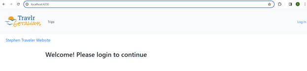
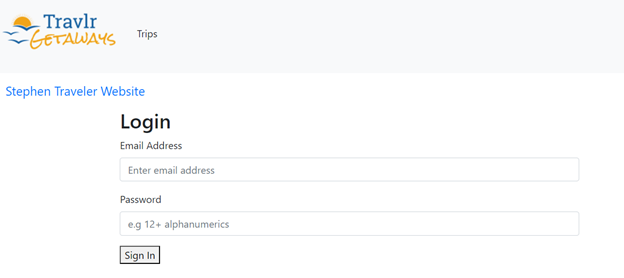
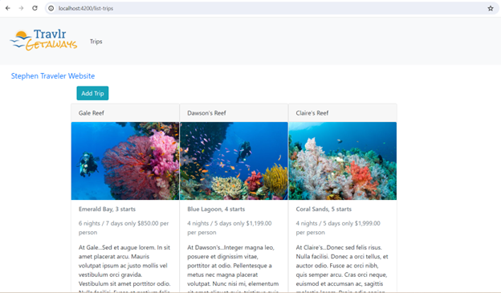
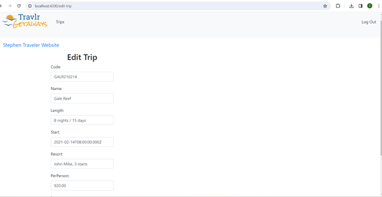
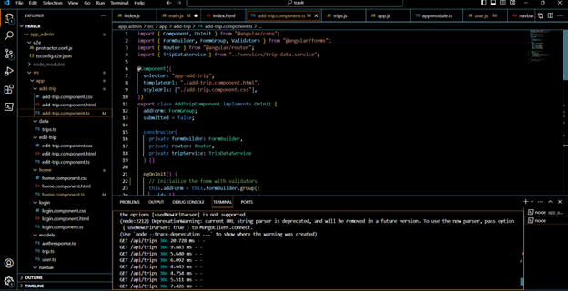

    

---

## Traveler Website - Full Stack Development I CS465 Full Stack Development I Databases: Category (Three)

---

The Traveler website facilitates the management and organization of travel-related information, catering to users' needs through web-based platforms. For instance, it enables users to plan their trips efficiently, providing real-time access to travel details and enhancing their travel experiences. The website offers seamless access to travel information from any device with internet connectivity. Initially, the development of the website prioritizes compatibility with various web browsers and platforms

My strategy for developing the traveler website involved using JavaScript programming language along with HTML and CSS for the frontend, and Node.js for the backend. The website is designed to be compatible with modern web browsers, ensuring accessibility for a wide range of users. During development, I sought assistance from collaborators to address any programming challenges and integrate design elements seamlessly. The source code is meticulously crafted to optimize the website's functionality and user experience. Collaborating with a team has been immensely beneficial, allowing for the exchange of ideas and expertise, ultimately enhancing the quality and innovation of the website.

    

        &nbsp;&nbsp;&nbsp;
        
    

    
<em>Figure 1 - Website Homepage and Website Welcome Page Screenshot</em>

I applied industry-standard coding practices and techniques in the development of the traveler website, adhering to JAVA best practices. This included incorporating in-line comments to explain code functionality, utilizing appropriate naming conventions for classes, methods, and variables, and ensuring consistent formatting and indentation to improve code readability and organization.

In adherence to coding standards, JAVA class files were named using camelCase CapWords, while layout files were named in lowercase. Global variables followed camelCase CapWords naming conventions, while variables scoped within class methods were named using camelCase or lowercase dash_names.

Method names were chosen to reflect their purpose and action, with comments providing summaries of class and method functionality. Methods that override superclass methods were named in camelCase with an initial lowercase word, while other methods followed camelCase with CapWords naming conventions. These practices collectively contribute to well-structured and maintainable codebase for the traveler website.

    &nbsp;&nbsp;&nbsp;
    
    
<em>Figure 2 - Login and User Haomepage Screenshot</em>

In the traveler website, user authentication relies on their email address as the username and their password for login credentials. Additionally, their phone number serves as a means to recover their password in case of forgetting. These features demonstrate our commitment to a zero-trust approach and underscore our focus on security throughout the development process.

Our security mindset encompasses anticipating potential adversarial exploits in software architecture and designs. We proactively identify and mitigate design flaws to ensure the privacy and enhanced security of user data and resources. Security considerations are integrated from the initiation phase through product assurance, testing, and compatibility checks across the entire software development life cycle.

We adhere to secure coding standards specific to the development language and platform of the traveler website. This includes implementing measures to prevent common security vulnerabilities and adopting best practices for secure authentication, data handling, and communication protocols. By prioritizing security at every stage of development, we aim to provide users with a trustworthy and resilient platform for their travel needs.

    

        &nbsp;&nbsp;&nbsp;
        
    

    
<em>Figure 3 - Edit Trip Page and Enhanced Code Screenshot</em>

Through the design and development of the components for the traveler website using Visual Studio Code, I effectively showcase my expertise in comprehending the relationships between various elements and activities. Integrating them seamlessly into the website's programmatic structure demonstrates my proficiency in web development principles and best practices.

Employing user-centered design principles and adhering to industry standards, I ensure that the traveler website meets the expectations of modern web applications. Prior to deployment, rigorous security assessments, product assurance checks, and compatibility tests are conducted to guarantee a smooth and secure user experience across different devices and browsers.

---

Artifact enhancement files repository at [CS465 Full Stack Development I](https://github.com/kowustep8719/kowustep8719.github.io/tree/main/enhancement/CS465-databases "Traveler Website - Repository")

---

    <a href="#top">
        <button style="font-size: 10px; font-weight: 500; background: #90ee90; color: #ffffff; border-radius: 50px; border-style: solid; border-color: #90ee90; padding: 5px 8px;">Back to Top &#8593;</button>
    </a>

<!-- Anchor element placed at the top of the page -->

