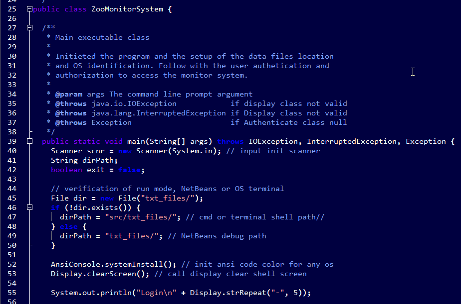

   

---

## Zoo Monitoring System Program IT145 Foundation in Application Development Algorithms and Data Structure Category

---

Managing a Zoo’s computer infrastructure includes two key components: controlling the access to system data and monitoring the animal/habitat activities in exhibits. As a duty of the role of managing the computer infrastructure, I have to develop a working program and detailed documentation describing the development process for the authentication and authorization of the people to gain access to data in the computer systems. Them, extend the program and process documentation to monitor the activities of the animals in the care of the zookeeper and monitor their living habitats.

    
    
<em>Figure 1 - Main Dashboard Module Admin Role</em>

The artifact involves the engineering of practices of validating input data and architect and design with default denial. This skill in us a security mindset that anticipates adversarial exploits in software architecture and design to expose potential vulnerabilities mitigate design flaws, and ensure privacy and enhanced data security and resource. The source code is split into different classes and methods based on their functionality and action. I showcase the engineering considerations of relationship and functionality between the different classes and methods by using arguments, parameters, and variables in scope.

Reading external files into a dynamic data structure of string array variable to evaluate user inputs' conditions, reading data files line-by-line to evaluate conditions, and reading data files to display their content on the screen. The string array is the simple linear data structure implemented over all the methods in the program classes. This approach improves the design and evaluation of computing solutions that solve a given problem using algorithmic principles and computer science practices and standards appropriate to its solution while managing the trade-offs involved in design choices.

    
    
<em>Figure 2 - ZooMonitorSystem Class Partial Code Example</em>

I employed industry-standard JAVA code best practices and techniques such as in-line comments, appropriate naming conventions, formatting, and indentation in conformance with proper coding standards, making the code easy to read and enhancing the application code organization. The program code is easy to read and follows formatting best practices defined by the industry, such as indentation in conformance with appropriate coding standards. The code is clearly and adequately documented with an easy-to-maintain commenting style and consistency.

The source code is well-structured, consistent in style, and consistently properly formatted, including line breaks. We utilize appropriate syntax and conventions in terms of their best practice and use in programming. The implemented data structures are programmatic, where the stored variable values can be used efficiently in other classes methods. Method names are verbs as they represent actions being performed on something. All cases are covered in an IF- -ELSEIF or CASE block, including ELSE or DEFAULT clauses. Loops avoid manipulating the index variable or using it upon exit from the loop.

---

Artifact enhancement files repository at [IT145 Foundation in Application Development](https://github.com/arsari/ePortfolio/tree/main/enhancement/IT145-algorithms "Zoo Monitoring System Program - Repository")

---

    <a href="#">
        <button style="font-size: 10px; font-weight: 500; background: #4169e1; color: #ffffff; border-radius: 50px; border-style: solid; border-color: #4169e1; padding: 5px 8px;">Back to Top &#8593;</button>
    </a>

