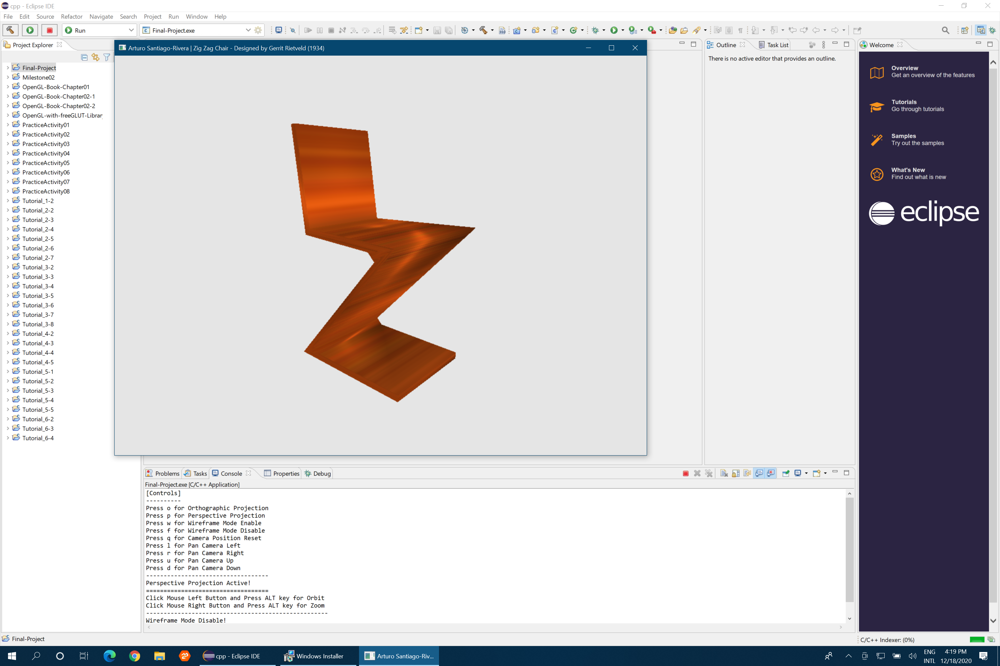
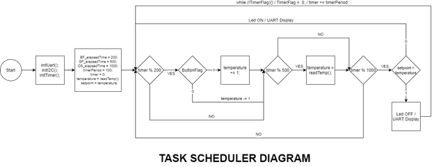
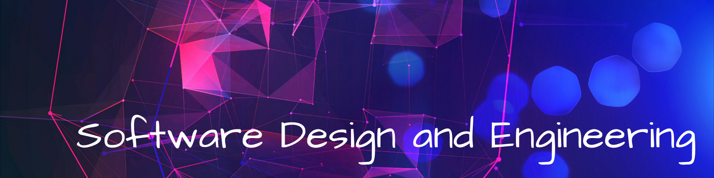

&nbsp;&nbsp;&nbsp;&nbsp;

## Welcome

This ePortfolio integrates the knowledge and skills I gained and developed throughout the years of studying a Computer Science program at Southern New Hampshire University (SNHU). It represent my growth in the program and gained honor rolls from high-quality outcomes. The ePortfolio was designed and developed with a professional-quality written and a visual communication demonstrative of my capacities and abilities in a coherent, technically sound, and appropriately adapted to an specific technical audience and context.

### <u>Table of Content</u>

&nbsp;[Professional Self-Assessment](#self-assessment "Professional Self-Assessment") 
&nbsp;&nbsp;&nbsp;&nbsp;&nbsp;[_Portfolio Considerations_](#portfolio-considerations "Portfolio Considerations") 
&nbsp;&nbsp;&nbsp;&nbsp;&nbsp;[_Preparing For The Future_](#preparing-for-the-future "Preparing for the Future") 
&nbsp;[Refinement Plan and Code Review](#codereview "Refinement Plan and Code Review") 
&nbsp;&nbsp;&nbsp;&nbsp;&nbsp;[_Code Review Videos Link_](#code-reviews-video-link "Artifacts Code Review Videos Link") 
&nbsp;[Software Design and Engineering](#softwaredesign "Software Design and Engineering") 
&nbsp;&nbsp;&nbsp;&nbsp;&nbsp;[_Artifact Software Design and Engineering_](#artifact-software-design-and-engineering "Artifact Software Design and Engineering") 
&nbsp;[Algorithms and Data Structure](#algorithms "Algorithms and Data Structure") 
&nbsp;&nbsp;&nbsp;&nbsp;&nbsp;[_Artifact Algorithms and Data Structure_](#artifact-algorithms-and-data-structures "Artifact Algorithms and Data Structure") 
&nbsp;[Databases](#databases "Databases") 
&nbsp;&nbsp;&nbsp;&nbsp;&nbsp;[_Artifact Databases_](#artifact-databases "Artifact Databases") 
&nbsp;[Reviews](#reviews "ePortfolio Reviews")

I started in the Computer Science program in January of 2018, studying for as long as five years. I plan to join the program to improve my background in the programming and development of applications and web services. This effort was because of my passion for working with computers and technology, performing web development, and have led some IT projects and implementing IT infrastructures during my years of practicing Architecture.

While in the Computer Science Program, I have learned and improved an innumerable number of abilities, skills, and knowledge. I have improved my attention to detail and security mindset as crucial skills to perform as a software engineer and developer. Being organized and cautious in my code development and doing it in simple blocks and testing as part of my workflow help me improve these skills and abilities. Testing is crucial to ensuring a program works and is free of weaknesses and vulnerabilities and becomes more complicated as a project grows in complexity. Acknowledging and adopting a tester mindset and a security mindset are well-required skills and abilities that improve continuously.

    
    
<em>Figure 1 - OpenGL ZigZag Chair - CS330 Computational Graphics and Visualization</em>

Attention to detail relates to code reviews, security standards, and best practices. Thinking with security in mind and not leaving it to the end is a way to gain a zero-trust ethic and approach that improves my coding skills. By combining code reviews and a security mindset, I can analyze my code and peer's code and look for mistakes and vulnerabilities that I may have missed during my focus on code development. Applying best practices and standards helps me produce formatted, understood, and maintainable software code and systems. In the same way, asking for help from peers to look at and review my work is another way to improve my abilities and skills in attention to detail and communication. Looking at my work with a fresh set of eyes helps me quickly discover overlooked mistakes.

I learn the importance of the Software Development Lifecycle and how to apply project management strategies working on a large-scale project as part of a team or as an individual. Many logistics go into planning a large project and coordinating with peers and team members. Understanding clients' needs as part of SDLC help to translate those needs into algorithms and pseudocode that result in a program. That incredible knowledge brings gratefulness and satisfaction when putting them into practice. All of the above soft skills and others like creativity, communication, and time management have been improved and increased during my years of study and professional work.

| **Hard Skills** | **Soft Skills** |
|:-----------:|:-----------:|
| Computer and Technology Skills | Organizational |
| Data Analysis | Attention to Detail |
| Data Visualization | Critical Thinking |
| Programming | Problem Solving |
| Software Development | Collaboration |
| Web Development | HTML/CSS/JS/Markdown |
| Technical Writing| JAVA |
| Security Mindset | Python |
| Mobile Development | C++ |

 

Through the program, I increased my capacity to learn new skills in a short time. Bring solutions to problems with intellectual humility and a leadership attitude to excel in computer science based on hard skills and abilities acknowledged from exercising computer and technology skills, data analysis, software development, and technical writing, demonstrated and exemplified in the artifacts accompanying this ePortfolio. All those skills and abilities make me an excellent software engineer prospect focused on developing algorithms that computers can understand but primarily that humans can understand.

    <a href="#">
        <button style="font-size: 10px; font-weight: 500; background: #4169e1; color: #ffffff; border-radius: 50px; border-style: solid; border-color: #4169e1; padding: 5px 8px;">Back to Top &#8593;</button>
    </a>

### _Portfolio Considerations_

<blockquote style="font-size: 20px;">
  <em>“Any fool can write code that a computer can understand. Good programmers write code that humans can understand.”</em>
  
by Martin Fowler

</blockquote>

Each of the courses throughout the Computer Science program has impacted and helped to acquire the knowledge, skills, and abilities necessary to position me in a job in the disciplines attached to Computer Science. While my learning was not limited to these classes, I felt that these were of more impact to me and expanded my roots into my initial plan of entering the Computer Science Program. From these courses, I learned and improved things I was not aware of being knowledgeable about or having the ability to grow in them. Because of that, I incorporate artifacts where the skills and skills learned in these courses, are demonstrated, showcased, and illustrated.

CS250 Software Development Lifecycle allows me to understand the Software Development Lifecycle and how communication with our team members and clients is essential. IT145 Foundation in Application Development and CS260 Data Structures and Algorithms was a great lesson on algorithms and data structure. Within these courses, I showcased my design approach and evaluation of computing solutions that solve a given problem using algorithmic principles and computer science practices and standards appropriate to its solution while managing the trade-offs involved in design choices. CS310 Collaboration and Team Project showed me the basics of collaboration and explained how working together is necessary for large projects.

    
    
<em>Figure 2 - Thermostat Lab Guide - CS350 Emerging Systems Architecture and Technologies</em>

CS360 Mobile Architecture and Programming and CS330 Computational Graphics and Visualization were an open mind to software design and engineering and computer graphics' complexity. In these two courses, I demonstrated my ability to use well-founded and innovative techniques, skills, and tools in computing practices to implement computer solutions that deliver value and accomplish industry-specific goals. CS340 Client/Server Development and DAT220 Fundamentals of Data Mining helped me learn about creating and using databases and showed how useful they are. I employed strategies for building collaborative environments that enable diverse audiences to support organizational decision-making in computer science through this course.

The courses artifacts chosen for the code review and the key categories of software design and engineering, algorithms and data structure, and databases, represent three different projects that allow me to demonstrate what I've learned throughout the program. I believe the enhancements made to these three projects represent my learning and display my competency in the program.

    <a href="#">
        <button style="font-size: 10px; font-weight: 500; background: #4169e1; color: #ffffff; border-radius: 50px; border-style: solid; border-color: #4169e1; padding: 5px 5px;">Back to Top &#8593;</button>
    </a>

### _Preparing For The Future_

The Computer Science program has helped me grow as a professional, preparing me to build a fulfilling and productive career and make a solid contribution to a computer science practice. Like a mountain climber approaching the summit, it is time to draw on my sense of motivation and refocus my energies. I have developed an ePortfolio that helps me take my place among computer science professionals; this is a significant achievement I am proud of.

I contend that my ePortfolio demonstrated my abilities to use well-founded and innovative techniques. I implemented computer solutions that deliver value and accomplish industry-specific goals exemplified through the development of functionalities that involves CSV data files being imported into MongoDB, the import of dependencies such as Python PyMongo driver, Python libraries, Dash framework, and a Python source code, and CRUD module to manipulate the data imported into MongoDB.

I designed and evaluated computing solutions that solve given problems using algorithmic principles and computer science practices and standards appropriate to its solution while managing the trade-offs involved in design choices through the engineering considerations of relationship and functionality between the different classes and methods by using arguments, parameters, and variables in scope in JAVA programming. All the enhanced artifacts demonstrate my emphasis on applying a security mindset during the development process to anticipate adversarial exploits in software architecture and designs to expose potential vulnerabilities, mitigate design flaws, and ensure privacy and enhanced security of data and resources.

I look forward to tasks where I can learn and grow. I am driven to complete work, no matter how difficult. If help is needed, I do not think I am weak; I look to improve and get more knowledge from senior, experienced coworkers and a great mentor. I will participate in a collaborative culture that creates exciting fresh solutions for the built environment that help clients and internal team members deliver the product vision with the highest outcome. As a highly dependable and diligent professional with a powerful sense of organization and an enthusiastic technical learner, I will enjoy entering into new technologies and quickly gaining the required skills. I genuinely look to excelling and pushing myself.

    <a href="#">
        <button style="font-size: 10px; font-weight: 500; background: #4169e1; color: #ffffff; border-radius: 50px; border-style: solid; border-color: #4169e1; padding: 5px 5px;">Back to Top &#8593;</button>
    </a>

 

As a software engineer, I know that code reviews are critical aspects of software development. Code reviews ensure quality assurance for our project's code and often identify critical bugs early on in its life cycle. However, the typical code review can be tedious with too many meetings and meetings that waste time. We can think that code reviews add an unnecessary bureaucracy to our development life cycle or believe we are too small to warrant the effort. In both instances, we are mistaken.

Code review is a systematic examination of the computer source code, sometimes known as peer review. I intend to find and fix mistakes overlooked in the initial development phase, improving the overall quality of the software and my developers' skills. In the professional world of programming, code reviews are a staple of quality assurance. A code review can be accomplished in various ways and with any requirements, but it is a straightforward concept stripped down to its bare essence. It is necessary for anyone interested in software engineering best practices.

    
    
<em>Figure 3 - Zoo Monitoring System Program Java Code Screenshot</em>

Code reviews catch errors when they’re cheap to fix, strengthen the team’s abilities, and add a certain amount of fault tolerance to the organization or individuals to better recover from disruptive changes. It results in better code, which is more easily maintained. Exercising a code review of the selected artifacts for software design and engineering, algorithms and data structure, and databases helped me to capacitate and employ strategies that help in the building of collaborative environments that enable diverse audiences to support organizational decision making in the field of computer science based on the critical elements of existing functionality code analysis, and enhancements.

### _Code Review Videos Link_

	

    <a href="#">
        <button style="font-size: 10px; font-weight: 500; background: #4169e1; color: #ffffff; border-radius: 50px; border-style: solid; border-color: #4169e1; padding: 5px 5px;">Back to Top &#8593;</button>
    </a>

 

As showcased in the [artifact code review](CodeReview "Refinement Plan and Code Review"), the artifact selected for the software design and engineering category is the **mobile application Inventory App**. The app's goal is to track an inventory of items using android mobile devices. The software was planned, designed, and develop as part of the CS360 Mobile Architecture and Programming computer science course. The application is developed in JAVA programming language with integration to the relational database SQLite. The development and programming tool used is Android Studio IDE. The testing and running of the app are through a Nexus device emulator inside Android Studio.

This artifact involved an entire software design and engineering process. It consists of design considerations of user experience and user interaction with different screens and actions that the application includes. Ensure an intuitive use of the application and its features through industry-standard icons and symbols. The engineering of practices of validate input data, architect and design for security mindset, and default deny. Evolve design and engineering considerations of relationship and functionality in their algorithms and data structure between the different classes and methods, and database in their layouts and source code. Evolve using a relational database to store the data created, read, updated, and deleted by users through the operation and use of the application.

    &nbsp;&nbsp;&nbsp;
    
    
<em>Figure 4 - Items Activity and Edit Alert Dialog Screenshot</em>

I designed and evaluated computing solutions that solve a given problem using algorithmic principles, computer science practices, and standards appropriate to our solution while managing the trade-offs involved in design choices through the implemented enhancements. The enhancements made the application fully functional by introducing a complete user CRUD functionality in the item's activity and improving the functionality, structure, and efficiency of the SQLHelper class function and methods.

I follow mobile development principles and best practices using user-centered design principles and industry standards through application development with this enhancement. The application of user-centered design principles demonstrates my ability to use well-founded and innovative techniques, skills, and tools in computing to implement computer solutions that deliver value and accomplish industry-specific goals. I implemented and practiced quality assurance techniques effective in identifying and eliminating vulnerabilities.

### _Artifact Software Design and Engineering_

	

    <a href="#">
        <button style="font-size: 10px; font-weight: 500; background: #4169e1; color: #ffffff; border-radius: 50px; border-style: solid; border-color: #4169e1; padding: 5px 5px;">Back to Top &#8593;</button>
    </a>

 

As presented in the [artifact code review](CodeReview "Refinement Plan and Code Review"), the artifact selected for the algorithms and data structure category is the **Zoo Monitoring System Program**. The program aims to develop an authentication system that manages authentication and authorization for zookeeper users and administrators. The program was planned, designed, and developed as part of the IT145 Foundation in Application Development computer science course. The program is produced in the JAVA programming language as a standalone application running in the computer terminal. The initial development and programming tool used was Apache NetBeans IDE; however,  I worked on the enhancements using a text editor. The testing and running of the app are through the computer terminal.

I selected this artifact because it involved understanding a program algorithm composed of two central systems, an authentication/authorization system, with the enhancement of modules for a monitoring system. Once the users enter the program, they only should see data related to their role. The artifact consists of design considerations to authenticate and authorize a user into the monitor system based on user credentials and the accountability of the user interaction with different modules screen and actions according to their role in the monitor system.

    
    
<em>Figure 5 - Zoo Monitoring System User Management Dashboard Screenshot</em>

I designed software that considers and interprets user needs and implement them into a program with a relation of activities in an organized structure. The enhancements allow the user to list animal/habitat options by reading from external animal files or habitats files, know the animals' activities in their care, and monitor their living habitats. Understanding the algorithms required by the program scenario gives the ability to translate it to pseudocode as one program code.

I developed an organized structure of a block of codes that can be separated into a primary class and four classes (modules). One of the four classes is a menu (Display Class) repetitive in the three key system modules, RoleModule, MonitorModule, and User Module. I introduce GUI actions into the program base to clear the shell screen, display a header and banner, and use two third-party classes, one for ANSI colors and the other for wrap lines. These actions align with user-centered design principles to demonstrate our ability to use well-founded and innovative techniques, skills, and tools in computing to implement maintainable computer solutions that deliver value and accomplish industry-specific goals.

### _Artifact Algorithms and Data Structures_

	

    <a href="#">
        <button style="font-size: 10px; font-weight: 500; background: #4169e1; color: #ffffff; border-radius: 50px; border-style: solid; border-color: #4169e1; padding: 5px 5px;">Back to Top &#8593;</button>
    </a>

 

As described in the [artifact code review](CodeReview "Refinement Plan and Code Review"), the artifact selected for the databases category is the **Salvare Search for Rescue Web App**. The web application aims to develop a web interface that works with an existing database from animal shelters to identify and categorize available dogs to train for different rescues. The web app was planned, designed, and developed for the CS340 Client/Server Development computer science course. The application is developed in Python with the Dash framework and the non-relational database MongoDB. The integration of Python and MongoDB is through the python driver PyMongo. The application can run in Jupyter Notebook as a test tool and the computer terminal with an internet browser. The application's functionality involves a CSV data file of existing dogs in shelters to import into MongoDB, the import of dependencies such as Python PyMongo driver, Python libraries, Dash framework, and a Python source code and CRUD module to manipulate the data imported into MongoDB.

This artifact involved a multi-tier application with a Model View Controller (MVC) and RESTful protocol design to extend the HTTP protocol to provide an application programming interface (API). The most attractive concept of the MVC pattern is a separation of concerns. The model's job is to manage the data, MongoDB, and Python data structures. The view's job is to decide what the user sees and how on their screen, Dash framework. The controller's responsibility is to pull, modify, and provide data to the user, the PyMongo driver. Each record in the MongoDB database is a document described in BSON, a binary representation of the data retrieved by the web app in a JSON format. When the main app file is executed in the computer terminal, the user opens an internet browser new tab pointing to the corresponding app address. The browser starts loading and generates the client-facing web application dashboard like the following screen:

    
    
<em>Figure 6 - Salvare Search Web App Client/Database Dashboard Screenshot</em>

The artifact enhancements focused on recreating the web application in a Windows environment after developing the source code in the Apporto Virtual Lab, a university remote desktop Linux platform. In recreating the web application, I designed software that considers and interprets user needs and implements them in an organized structure. Guided by the produced initial documentation, I recreated the web application environment, updating and revising the documentation according to the actions executed to replicate and run the web application in a Windows terminal.

The process of setup and running the web application was challenging. However, I demonstrated my abilities to use well-founded and innovative techniques, skills, and tools in computing practices through the operation of the setup of Python and MongoDB before starting to follow the guidance in the web application documentation. Going through Python and MongoDB's setup procedures and updating the web app source code functionality because of changes in the PyMongo driver version and an upgraded MongoDB platform showcase my implementation of computer solutions that deliver value and accomplish industry-specific goals.  

### _Artifact Databases_

	

    <a href="#">
        <button style="font-size: 10px; font-weight: 500; background: #4169e1; color: #ffffff; border-radius: 50px; border-style: solid; border-color: #4169e1; padding: 5px 5px;">Back to Top &#8593;</button>
    </a>

## Reviews

<blockquote id="reviews" class="review-container" cite="https://learn.snhu.edu/d2l/lms/grades/my_grades/main.d2l?ou=1014915">
	
	
Brooke Goggin, M.S., M.S., M.S., Ed.D(ABD) SNHU Computer Science Adjunct Faculty

	<em>"Being able to present your work in a cohesive manner is a skill that you will continue to refine in your career. The Zoo Monitoring with security and efficiency enhancements and interface as well as your extensive narratives is great work. This is a sound demonstration of making code  more concise and therefore with this change a bit faster. Wonderful explanation of what you did with the application to integrate Python with the Dash framework. Code is clean and well commented! You made it. Congratulations and you should be proud. The hard skills and soft skills table is great. Very well done portfolio with clear content of your depth of understanding!"</em>
</blockquote>

    <a href="#">
        <button style="font-size: 10px; font-weight: 500; background: #4169e1; color: #ffffff; border-radius: 50px; border-style: solid; border-color: #4169e1; padding: 5px 5px;">Back to Top &#8593;</button>
    </a>

