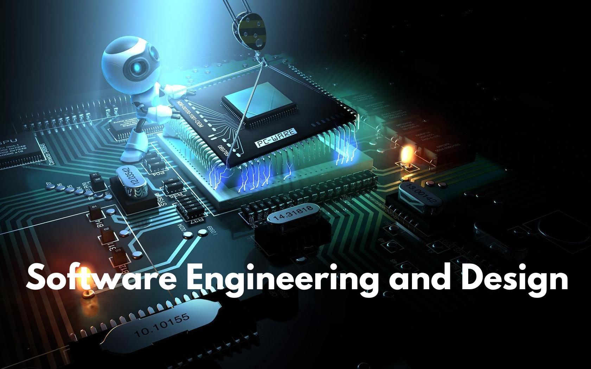

&nbsp;&nbsp;&nbsp;&nbsp;

## Welcome Address!
My ePortfolio strongly depicts my journey through the Computer Science program at Southern New Hampshire University. It is a testament to my growth and accomplishments, showcasing my milestones, including recognition on the President's List and consistent placement on the honor roll. I've carefully crafted the ePortfolio to show visually and technically what I've learned and achieved throughout this computer Science program. It's all about demonstrating my skills and abilities clearly and professionally, aimed at a technical audience. 

Through my ePortfolio, I want to share my passion for computer science and dedication to doing my best in every aspect of my studies. Throughout my Computer Science program, I've gained invaluable experience in coding, problem-solving, and software development. From mastering programming languages like Python and Java to understanding complex algorithms and data structures, I've honed my technical skills to tackle any challenge. Additionally, I've had the opportunity to work on various projects, both independently and collaboratively, which have further enhanced my problem-solving abilities and teamwork skills.

### <u>Table of Content</u>

&nbsp;[Professional Self-Assessment](#self-assessment "Self-Assessment") 
&nbsp;&nbsp;&nbsp;&nbsp;&nbsp;[_Portfolio Selections_](#portfolio-selections "Portfolio Selections") 
&nbsp;&nbsp;&nbsp;&nbsp;&nbsp;[_Future Career Preparation_](#future-career-preparation "Future Career Preparation") 
&nbsp;[Refinement Plan and Code Review](#codereview "Refinement Plan and Code Review") 
&nbsp;&nbsp;&nbsp;&nbsp;&nbsp;[_Code Review Videos Link_](#code-reviews-video-link "Artifacts Code Review Videos Link") 
&nbsp;[Software Design and Engineering](#softwaredesign "Software Design and Engineering") 
&nbsp;&nbsp;&nbsp;&nbsp;&nbsp;[_Artifact Software Design and Engineering_](#artifact-software-design-and-engineering "Artifact Software Design and Engineering") 
&nbsp;[Algorithms and Data Structure](#algorithms "Algorithms and Data Structure") 
&nbsp;&nbsp;&nbsp;&nbsp;&nbsp;[_Artifact Algorithms and Data Structure_](#artifact-algorithms-and-data-structures "Artifact Algorithms and Data Structure") 
&nbsp;[Databases](#databases "Databases") 
&nbsp;&nbsp;&nbsp;&nbsp;&nbsp;[_Artifact Databases_](#artifact-databases "Artifact Databases") 
&nbsp;[Reviews](#reviews "ePortfolio Reviews")

I was admitted to Southern New Hamshire University in May 2021 and started taking some courses. In late 2021, I enrolled in the Computer Science program with the short-term goal of obtaining an Associate in Science in Computer Science. I wanted to test how my little programming skills will help me in the Computer Science program if I pursue my bachelor's. After completing my associate degree in March 2023, I became interested in pursuing a Bachelor of Science in Computer Science. I continued after the associate without taking a break in April 2023. 
This program has inspired me to pursue excellence in computer science, driving me to continually enhance my skills and knowledge in programming and application development. It has ignited a passion within me to explore new technologies and contribute meaningfully to the field of IT.

While in the Computer Science Program, I've acquired numerous abilities, skills, and knowledge integral to succeeding in the field. One area of notable improvement has been my attention to detail and security mindset, which are essential traits for effective software engineering and development. Embracing organization and caution in my code development process, breaking down tasks into manageable blocks, and incorporating rigorous testing into my workflow have been instrumental in refining these skills. As projects increase in complexity, the importance of thorough testing becomes even more evident, ensuring the integrity and robustness of the software. Cultivating a tester mindset and a strong focus on security are ongoing endeavors that contribute significantly to my professional growth.

Moreover, participating in collaborative projects within the program has allowed me to refine my communication and teamwork skills, which are essential for navigating the dynamic landscape of software development. Additionally, the program's emphasis on staying abreast of emerging technologies has inspired me to remain curious and continuously expand my skill set to stay ahead in this ever-evolving field. Furthermore, the exposure to real-world coding challenges through practical assignments has honed my problem-solving abilities and fostered a resilient attitude toward overcoming obstacles. Lastly, the supportive learning environment and guidance from experienced faculty members have instilled in me confidence and determination to excel in my future endeavors in computer science.

    
    
<em>Figure 1 - Animal Shelter - CS340 Client/Server Development</em>

Improving my skills through enhancement and embracing a security-centric mindset emerged as pivotal traits essential for excelling as a software engineer. My approach to code development has evolved to emphasize organization, employing concise blocks and rigorous testing protocols within my workflow, thereby fortifying my capabilities in these domains. Through a holistic approach combining rigorous code reviews with a vigilant eye for security, I thoroughly analyze my code and my peers, identifying any overlooked flaws or vulnerabilities that may have eluded detection during development. Moreover, proactive engagement in ongoing training and professional development activities ensures that my skills remain sharp and adaptable to evolving industry trends and challenges. By actively seeking out opportunities for collaboration and knowledge-sharing within the programming community, I expand my repertoire of techniques and approaches to problem-solving, further enhancing my ability to deliver robust and innovative software solutions.

I was exposed to various courses like Database Management Systems throughout my computer science program. I learned to apply project management strategies in executing large-scale projects as part of a team or individually. Many intricacies accompany planning such projects and coordinating with peers and team members. Understanding the intricacies of database management and client requirements has been invaluable in translating these needs into practical solutions. This knowledge has been intellectually enriching and brought a sense of fulfillment when applied in real-world scenarios.
Additionally, courses such as Data Structures and Algorithms have refined my analytical skills and problem-solving abilities, contributing to my overall growth as a computer science professional. Moreover, the program has enhanced soft skills like effective communication and adept time management, which have proven indispensable in academic and professional pursuits. Furthermore, coursework in Computer Networks has broadened my understanding of network architecture and protocols, allowing me to comprehend the intricacies of data transmission and network security, thus equipping me with practical skills for addressing real-world networking challenges.

| **Hard Skills** | **Soft Skills** |
|:-----------:|:-----------:|
| Computer Network | Communication |
| Computer Operating System | Adaptability |
| Algorithms | Problem-Solving |
| Computer and Technology Skills | Organizational |
| Computer Security | Attention to Detail |
| Data Analysis | Attention to Detail |
| Programming Languages | Adaptability |
| Data Visualization | Critical Thinking |
| Embedded System | Attention to Detail |
| Programming | Problem Solving |
| Software Development | Collaboration |
| HTML/CSS/JS/Markdown | Probelm-Sloving |
| Web Development | Collaboration |
| Technical Writing| Communication|
| Security Mindset | Critical Thinking |
| Mobile Development | Adaptability|
| Java | Problem-solving |
| Python | Creativity |
| C++ | Analytical Thinking |

 

Throughout my journey in the computer science program, I've honed my ability to acquire new skills and knowledge rapidly. With a blend of intellectual humility and a proactive leadership approach, I've tackled challenges head-on, leveraging my expertise in various areas such as computer and technology skills, data analysis, software development, and technical writing. These competencies are evident in the artifacts showcased in my ePortfolio. As I continue to evolve, I aspire to channel my strengths toward becoming a proficient software engineer, focusing on crafting algorithms that are understandable to computers and intuitive for humans to grasp and utilize effectively. My journey in computer science has also instilled in me a deep-seated passion for innovation and problem-solving. Armed with a diverse skill set and a drive for continuous growth, I am committed to making meaningful contributions to the ever-evolving technology field.

    <a href="#">
        <button style="font-size: 10px; font-weight: 500; background: #6A5ACD; color: #ffffff; border-radius: 50px; border-style: solid; border-color: #6A5ACD; padding: 5px 8px;">Back to Top &#8593;</button>
    </a>

### _Portfolio Selections_

<blockquote style="font-size: 20px;">
  <em>"Code never lies, comments sometimes do."</em>
  
by Ron Jeffries

</blockquote>

There are several courses in the computer science program I took that have helped improve my skills and knowledge and made me interested in pursuing this bachelor's degree. The wide range of courses offered in the computer science program has been crucial in providing me with the fundamental understanding, abilities, and proficiencies required to succeed in various computer science fields. Even though I studied a wide range of topics, I discovered that several courses had a huge impact and formed the basis of my Computer Science academic path. These classes confirmed my dedication to this area by expanding my horizons and deepening my understanding. Through rigorous study and hands-on learning experiences, I discovered and sharpened skills previously unknown to me, laying a solid foundation for my career aspirations. To illustrate the depth of my learning and mastery in these courses, I have integrated artifacts that vividly demonstrate and exemplify the competencies acquired throughout my educational journey. The Computer Science program has been pivotal in shaping and enhancing my skills and knowledge in the IT field. With each course, I've diligently refined my abilities, gaining a deeper understanding and proficiency in various aspects of computer science. As I progress through the program, I'm continuously challenged to push the boundaries of my learning and skillset, preparing me for the demands of the ever-evolving tech industry.

CS320 - Software Testing, Automation, and Quality Assurance provides an in-depth exploration of software testing methodologies, automation techniques, and quality assurance practices. This course gave me a comprehensive understanding of the importance of testing in the software development lifecycle. I learned various testing strategies, including manual and automated testing approaches, and how to design, implement, and execute test plans to ensure the quality and reliability of software products. 

CS360 - Mobile Architecture and Programming delves into the intricacies of mobile application development, focusing on architectural principles and programming techniques for mobile platforms. This course gave me a comprehensive understanding of the fundamental concepts and design patterns underlying mobile architecture. I learned to develop mobile applications using industry-standard frameworks and programming languages, such as Swift for iOS and Kotlin for Android. 

CS465 - Full Stack Development I and CS340 - Client/Server Development provided invaluable insights into the intricacies of full stack and client/server development. Throughout these courses, I honed my skills in designing, implementing, and deploying robust web applications that leverage both front-end and back-end technologies. By delving into web architecture, server-side programming, and database management, I comprehensively understood the complexities involved in building scalable and efficient web solutions. Additionally, I learned how to integrate various technologies and frameworks to create seamless user experiences and optimize performance. Through hands-on projects and practical assignments, I showcased my ability to develop end-to-end solutions that adhere to industry best practices and standards, effectively managing trade-offs and ensuring the delivery of high-quality computing solutions. 

IT145 - Foundation in Application Development serves as a fundamental introduction to the principles and practices of application development. Through this course, I acquired a solid understanding of essential programming concepts and techniques, laying the groundwork for my journey in software development. By exploring topics such as programming languages, algorithms, and problem-solving strategies, I gained the foundational skills necessary to analyze, design, and implement computing solutions. Additionally, the course provided valuable insights into software development methodologies and best practices, fostering a disciplined approach to building reliable and efficient applications. Through hands-on exercises and projects, I applied theoretical concepts to real-world scenarios, honing my ability to develop functional and user-friendly software solutions. Overall, IT145 played a crucial role in shaping my understanding of application development and preparing me for advanced coursework in the field.

    
    
<em>Figure 2 - Traveler Website - CS465 Full Stack Development I</em>

CS305 - Software Security delves into the critical aspects of safeguarding software systems from various security threats and vulnerabilities. Throughout this course, I delved into the principles, techniques, and best practices for ensuring the security and integrity of software applications. By exploring topics such as authentication, encryption, access control, and secure coding practices, I understood the fundamental concepts underlying software security. Additionally, the course emphasized the importance of threat modeling, risk assessment, and vulnerability analysis in identifying and mitigating potential security risks. Through practical exercises, case studies, and hands-on projects, I developed the skills and knowledge to assess, design, and implement secure software solutions that protect against cyber threats and adhere to industry standards and regulations.

CS255 - System Analysis and Design provided me with a comprehensive exploration of the methodologies, principles, and techniques used in analyzing, designing, and implementing software systems. Through this course, I gained a deep understanding of the entire software development lifecycle, with a specific focus on the analysis and design phases. By studying topics such as requirements elicitation, modeling techniques, system architecture, and design patterns, I learned how to effectively gather and document user requirements, conceptualize system architectures, and develop detailed design specifications. Additionally, the course emphasized the importance of iterative development processes, user feedback, and collaboration in ensuring the successful delivery of software projects.

DAD220 - Introduction to Structured Database Environments offered me a foundational understanding of structured database management systems (DBMS) and their essential principles. Throughout this course, I explore the core concepts of database design, implementation, and management. Topics covered include relational database models, entity-relationship diagrams, normalization techniques, and SQL query language. I gain practical experience in designing and querying databases, understanding the importance of data integrity, security, and efficiency. Additionally, the course introduces me to various database management system tools and technologies, preparing me for more advanced database-related coursework and real-world applications in data-driven environments.

Through the skills gained from the various courses I have taken during this computer science program, I could select three courses to represent each of the three categories of the artifact. The three-course artifacts I selected represent the categories of Software Engineering and Design, Algorithm and Data Structures, and Databases. I selected CS370-Current and Emerging Trends in Computer Science, CS360 - Mobile Architecture and Programming, and CS465-Full Stack Development I to represent each category. I used the previous projects that were completed from these courses for my code review and enhancement. Through these courses and the artifacts I've selected, I have demonstrated proficiency in software engineering, algorithmic problem-solving, and database management, preparing me for a successful career in computer science. These skills collectively position me as a well-rounded and versatile computer scientist capable of tackling a wide range of challenges and contributing effectively to the development of innovative solutions in the field.

    <a href="#">
        <button style="font-size: 10px; font-weight: 500; background: #ff6347; color: #ffffff; border-radius: 50px; border-style: solid; border-color: #ff6347; padding: 5px 5px;">Back to Top &#8593;</button>
    </a>

### _Future Career Preparation_

Completing a degree in computer science has not just given me a wealth of knowledge and technical skills. It has also instilled in me a deep sense of confidence and preparedness for tackling real-world challenges in the field. Completing the Computer Science program has been a transformative journey, equipping me with the skills, knowledge, and confidence necessary to embark on a successful career. Like a skilled craftsman honing their craft, I have diligently cultivated my abilities and am now poised to make meaningful contributions to computer science. Standing on the threshold of my future career, I am filled with purpose and determination. The program has provided me with a solid foundation in software engineering, algorithmic problem-solving, and database management, laying the groundwork for my professional aspirations. Armed with this expertise, I am ready to tackle the challenges and opportunities that lie ahead. Looking forward, I am committed to continuous learning and professional growth. Just as technology evolves rapidly, my skills and knowledge must also adapt to meet the demands of an ever-changing landscape. I am eager to stay abreast of emerging trends and technologies, seeking further specialization and development opportunities.

Moreover, I am excited to leverage the ePortfolio I have developed throughout the program to showcase my accomplishments and capabilities. This digital portfolio is a testament to my journey and achievements, providing prospective employers with a comprehensive overview of my skills, projects, and experiences. In essence, completing the Computer Science program marks not the end but the beginning of my career journey. With determination, perseverance, and a commitment to excellence, I am confident that I will carve out a fulfilling and impactful career in the dynamic and ever-expanding field of computer science.

My ePortfolio is a testament to my ability to leverage diverse tools, techniques, and methodologies to develop innovative and value-driven computer solutions. Across diverse project developments, I've showcased my ability to craft computer solutions that fulfill and surpass industry-specific goals. One notable example is the implementation of functionalities within my projects that involve the seamless importation of CSV data files into MongoDB, a NoSQL database management system. This task required a deep understanding of data manipulation techniques and database management principles, which I effectively applied to ensure a smooth and efficient data transfer. Furthermore, I showcased my adeptness in incorporating essential dependencies such as the Python PyMongo driver, Python libraries, and the Dash framework into my projects. By leveraging these tools effectively, I enhanced the functionality and performance of my applications, demonstrating my versatility in working with diverse technology stacks.

Throughout the Computer Science program, I designed, developed, and delivered professional-quality oral, written, and visual communications that are coherent, technically sound, and appropriately adapted to specific audiences and contexts. This multifaceted competency was honed through coursework, project engagements, and the duration of my ePortfolio. I actively participated in presentations, team meetings, and project discussions, where I effectively articulated complex technical concepts clearly and concisely. Written communication was another cornerstone of my skill development, as I consistently produced comprehensive reports, documentation, and analyses. From documenting software requirements to crafting detailed project proposals, I prioritized clarity, accuracy, and technical precision in my written communications.

I developed a security mindset that anticipates adversarial exploits in software architecture and designs to expose potential vulnerabilities, mitigate design flaws, and ensure data and resources' privacy and enhanced security. This proactive approach has been instrumental in shaping my approach to software development, as I prioritize security considerations at every stage of the process.
By fostering a deep understanding of security principles and best practices, I have honed the ability to analyze software architectures and designs from a security perspective. This involves identifying potential attack vectors and vulnerabilities and implementing robust security measures to mitigate risks and safeguard sensitive information. Throughout my academic journey, I have actively engaged with coursework, practical assignments, and independent study to gain expertise in various security domains. Topics such as threat modeling, risk assessment, secure coding practices, cryptography, and network security protocols have become integral to my skill set. My development of a security mindset has enabled me to contribute to creating secure, resilient, and privacy-enhanced software solutions.

I employed strategies for building collaborative environments that enable diverse audiences to support organizational decision-making in computer science. By implementing these strategies, I created inclusive spaces where individuals from various backgrounds and perspectives could actively contribute to the decision-making process. I participated in group projects and team-based assignments throughout the program, where I actively contributed to collaborative efforts to solve complex problems. By working closely with my peers from diverse backgrounds, I honed my communication, teamwork, and conflict-resolution skills, all essential for building collaborative environments. Furthermore, I provided evidence of my ability to adapt my communication style to specific audiences and contexts within my ePortfolio.

I approach tasks with a keen appetite for learning and growth, seeking challenges that push my boundaries. I eagerly anticipate opportunities that challenge me to learn and develop my skills further. I am motivated by difficult tasks and am committed to seeing them through to completion. Rather than viewing asking for help as a sign of weakness, I see it as an opportunity to enhance my knowledge and expertise by learning from experienced colleagues and mentors. I am excited to join a team that works together to provide creative solutions that benefit internal team members and clients. As a committed and well-organized professional, I get great satisfaction from learning new skills and quickly adjusting to shifting environments. I push limits and go above and beyond every time because I'm passionate about never stopping myself from improving.

    <a href="#">
        <button style="font-size: 10px; font-weight: 500; background: #008000; color: #ffffff; border-radius: 50px; border-style: solid; border-color: #008000; padding: 5px 5px;">Back to Top &#8593;</button>
    </a>

 

As a software engineer, I recognize code reviews' pivotal role in software development. They serve as essential checkpoints for ensuring the quality and reliability of our codebase, often uncovering critical bugs and inconsistencies before they escalate. Yet, it's not uncommon for code reviews to become bogged down by excessive meetings and inefficient processes, leading some to question their value. They provide opportunities for knowledge sharing, mentorship, and continuous improvement, ultimately enhancing our development lifecycle's overall efficiency and effectiveness. In essence, embracing code reviews is not just about compliance; it's about investing in our software projects' long-term success and sustainability.

Code review in software development is a systematic review of source code by one or more developers to improve code quality, identify errors, ensure adherence to coding standards, and promote knowledge sharing among a team of developers. This process not only enhances the overall quality of the software but also contributes to the professional growth of developers by refining their skills. It helps identify and eliminate bugs in code at the early stages of the development process before the product is deployed. Code review also helps ensure the overall quality of the codebase by allowing multiple sets of eyes to examine the code, thereby reducing the likelihood of bugs, defects, and vulnerabilities making their way into the final product. Code review also facilitates teamwork and knowledge sharing, maintains code quality, and assures that coding standards are followed, eventually delivering a more dependable and maintainable software product. 

    
    
<em>Figure 3 - Traveler Website Java Code Screenshot</em>

Code reviews elevate team capabilities, pinpoint faults in their nascent stages, and instill a level of resilience that enables organizations and individuals to navigate disruptive shifts with greater ease. This process yields superior code quality and simplifies maintenance efforts. I refined my ability to devise and execute strategies conducive to fostering collaborative environments by conducting code reviews on selected artifacts about databases, algorithms, data structures, and software design and engineering. These environments are tailored to diverse audiences and facilitate informed organizational decision-making. Central to this endeavor is the analysis of existing functionality code and the implementation of targeted enhancements. Through these code reviews, I gained valuable insights into best practices and refined my ability to identify and address potential issues early on. This not only contributed to the improvement of individual artifacts but also enhanced my overall understanding of software development principles.

### _Videos Link To Code Review_

    

    <a href="#">
        <button style="font-size: 10px; font-weight: 500; background: #6cb9c8; color: #ffffff; border-radius: 50px; border-style: solid; border-color: #6cb9c8; padding: 5px 5px;">Back to Top &#8593;</button>
    </a>

 

Through my demonstration in the code review, that is, the [artifact code review](CodeReview "Refinement Plan and Code Review"), the selected artifact for the Software Engineering and Design category is the "Treasure Maze Hunt Game." The artifact is obtained from my previous course in the computer science program CS370-Current/Emerging Trends in CS in 2023. The goal is to create a deep Q-learning algorithm to build a model that trains intelligent agents to move through a maze to find a hidden treasure. I selected this artifact to include in my ePortfolio because it includes many features and characteristics of the Software Engineering and Design process. Developing the maze navigation path involves various software design and engineering aspects, including problem-solving, system architecture, modularity, testing, optimization, user experience design, and documentation. The program was developed using Python and integrated into Jupyter Notebook.

This artifact represents a culmination of the software design and engineering process, which is exemplified by the creation of the "Treasure Maze Hunt Game: Human Brain and Artificial Neural Network. The primary objective was to develop an algorithm model capable of training an intelligent agent, referred to as the Pirate, to navigate through a maze in search of a concealed treasure. It demanded problem-solving, system architecture, and optimization to ensure the efficient operation of the intelligent agent within the maze. Each facet of the algorithm, from pathfinding logic to obstacle avoidance strategies, required careful consideration and implementation to achieve desired outcomes. Modularity and testing played pivotal roles in the development process, emphasizing the importance of iterative refinement and quality assurance in software engineering. Through continuous enhancement and testing iterations, the algorithm underwent refinement, resulting in a well-structured and maintainable maze navigation system. In essence, the "Treasure Maze Hunt Game epitomized the convergence of creativity and technical proficiency in software design and engineering. By harnessing advanced algorithms and reinforcement learning techniques, this artifact exemplified the relentless pursuit of excellence in crafting intelligent systems capable of navigating complex environments, which is a hallmark of the computer science discipline.

    &nbsp;&nbsp;&nbsp;
    
    
<em>Figure 4 - qtrain function code and Maze Environment Screenshot</em>

I designed and evaluated computing solutions that solve a given problem using algorithmic principles, computer science practices, and standards appropriate to its solution while managing the trade-offs in design choices. I achieved this objective through the enhancement of implementing the Q-learning algorithm in the qtrain function, which adheres to the established algorithmic principles and standards in reinforcement learning. This demonstrates my proficiency in designing computing solutions based on rigorous algorithmic principles. Also, monitoring metrics such as loss win rate, which were provided in the enhanced code, and completion criteria during training evaluate the effectiveness and convergence of the machine learning model. This adheres to established standards for assessing model performance and ensures the reliability of the computing solution.

I employed strategies for building collaborative environments that enable diverse audiences to support organizational decision-making in the field of computer science. This objective is achieved through the enhancement by utilizing descriptive variable names such as n_epoch, max_memory, and win_rate, alongside detailed documentation, fostering a collaborative environment by making the codebase easily understandable and modifiable by multiple developers. This helps promote collaboration by reducing ambiguity and enhancing code readability. Also, structuring the code into separate modules with well-defined responsibilities such as "TreasureMaze.py", "GameExperience.py," and "qtrain Function" enables multiple developers to work on different components simultaneously without interference. This promotes collaboration and facilitates efficient development and maintenance of the codebase.

I designed, developed, and delivered professional-quality oral, written, and visual communications that are coherent, technically sound, and appropriately adapted to specific audiences and contexts." This outcome is achieved through the enhancement of the code comment. The addition of clear and concise comments throughout the codebase ensures that the purpose, functionality, and decision-making processes are well-documented. This makes the code coherent and accessible to other developers or stakeholders, meeting the outcome of professional-quality communications. Also, I ensured that detailed feedback on the training progress, including epoch details, loss, win count, and win rate, was provided, which enhanced communication about the model's performance and convergence. Stakeholders can easily understand the progress and outcomes of the training process.

I demonstrated an ability to use well-founded and innovative techniques, skills, and tools in computing practices to implement computer solutions that deliver value and accomplish industry-specific goals. I achieved this outcome through code enhancement by implementing the experience replay mechanism through the GameExperience class, demonstrating the use of a well-founded technique in reinforcement learning. This enhances the efficiency of model learning, showcasing proficiency in applying established techniques. Also, the dynamic adjustment of the exploration factor (epsilon) based on the win rate showcases an innovative approach to balancing exploration and exploitation in reinforcement learning. This demonstrates the ability to apply creative solutions to solve complex problems effectively.

### _Artifact Software Design and Engineering_

    

    <a href="#">
        <button style="font-size: 10px; font-weight: 500; background: #008000; color: #ffffff; border-radius: 50px; border-style: solid; border-color: #008000; padding: 5px 5px;">Back to Top &#8593;</button>
    </a>

 

The artifact chosen for the Algorithms and Data Structures is the **Inventory Mobile App**, as demonstrated in the [artifact code review](CodeReview "Refinement Plan and Code Review"). I selected it from my computer science course, CS-360: Mobile Architecture and Programming, which I took in 2023 during the January – February term. The artifact aims to develop a mobile app that can track inventories of items in warehouses or shops and can be accessed through Android mobile devices. The application is built using the Java programming language and linked with the relational database SQLite. The development and programming were facilitated by using the Android Studio IDE. Also, comprehensive testing, such as unit tests and application execution, was conducted within the Android Studio environment to ensure compatibility and performance across various Android platforms. 

The chosen artifact revolves around Algorithms and Data Structures, encompassing a comprehensive process of algorithm design and implementation. It entails considerations regarding the interaction of users with various algorithms and data structures implemented within the application. It entails considerations regarding the interaction of users with various algorithms and data structures implemented within the application. Emphasis is placed on ensuring intuitive utilization of the algorithms and their functionalities, incorporating industry-standard symbols and icons for a seamless user experience.

    
    
    
<em>Figure 5 - Mobile App Sign-in and Edit Item Dialog Screenshot</em>

The skills demonstrated through this enhancement helped me successfully "design and evaluate computing solutions that solve a given problem using algorithmic principles and computer science practices." I achieved this course outcome by applying the user-centered approach and following the principles of identifying problems, designing algorithms tailored to those problems, implementing them effectively into code, and rigorously testing and refining the solutions. The code implements algorithms for database operations such as creating, reading, updating, and deleting user records. For example, methods like createUser() and updateUser() employ algorithms to manipulate user data efficiently within the SQLite database. These algorithms are designed to optimize database transactions and ensure the smooth operation of the app.

I developed a security mindset that anticipates adversarial exploits in software architecture and designs to expose potential vulnerabilities, mitigate design flaws, and ensure privacy and enhanced security of data and resources." This is achieved through artifact enhancement by incorporating robust user authentication mechanisms to verify users' identity before granting access to sensitive functionalities. This includes features like password validation and secure session management to prevent unauthorized access to user accounts, such as adding login and account creation mechanisms to the app layouts. In the enhanced code artifact, sensitive user data, such as passwords, is securely stored within the SQLite database. The use of parameterized queries and prepared statements in database interactions helps prevent SQL injection attacks, mitigating potential vulnerabilities in the software architecture.

Throughout the process, I ensured adherence to established computer science practices, resulting in the successful design and evaluation of computing solutions within mobile app development. Employing user-centered design principles demonstrates my skills in utilizing established and inventive methodologies, expertise, and technologies within computing to create computer solutions that add value and achieve industry-specific objectives. I also employed the best coding standard practices to enhance the code's readability, maintainability, and comprehensibility, making it easier for other developers to read and improving the organization of the application code. By incorporating proper in-line comment conventions throughout the codebase, indentation, and proper code formatting, I ensured that developers could easily jump in and understand each component's purpose, functionality, usage, method, and class. These comments serve as valuable documentation, guiding developers through the intricacies of the code and facilitating collaboration among team members.

### 
Artifact Software Engineering and Design

	

    <a href="#">
        <button style="font-size: 10px; font-weight: 500; background: #4169e1; color: #ffffff; border-radius: 50px; border-style: solid; border-color: #4169e1; padding: 5px 5px;">Back to Top &#8593;</button>
    </a>

 

The artifact selected for the databases is the Traveler Website, as demonstrated in the [artifact code review](CodeReview "Refinement Plan and Code Review"). This traveler website was created during my computer science course, CS-465: Full Stack Development I. I took this course in the year 2023. The website was developed using the JavaScript application, which uses the Node.js runtime environment with the Express framework for the back-end and the Angular framework for the front-end. I also used HTML and CSS to structure the content on the travel website pages. The application combines both Node.js (for the back-end) and Angular (for the front-end), making it a MEAN (MongoDB, Express.js, Angular, Node.js) stack application. It also integrates with MongoDB using Mongoose for database operations.

I added the traveler website artifact to my ePortfolio because it demonstrates several valuable skills and competencies in databases to potential employers, recruiters, or educational institutions. Also, I added this artifact to my ePortfolio because I would like to effectively showcase my technical skills, problem-solving abilities, and creativity to potential employers to increase my chances of hiring. The integrated authentication mechanisms, RESTful API consumption, and dynamic content rendering demonstrate my ability to create functional and secure web applications tailored for real-world scenarios, which employers always want to see from their employees. Upon running the travel website, the Angular Live Development Server initiates and starts listening on localhost:4200, prompting users to open their browser and navigate to http://localhost:4200/. The server compiles successfully, generating the necessary files for the web application to function correctly. The application fetches data from the MongoDB database as the server runs, triggering HTTP GET requests to retrieve trip information. Each request is processed, and the corresponding trips are fetched and displayed on the website.

    
    
    
<em>Figure 6 - Traveler Website Login Page and Homepage Screenshot</em>

The enhancement of the artifact aligns closely with the course objective of developing a security mindset in software development, as it encompasses various security measures and considerations aimed at safeguarding data and resources against potential threats and exploits. This objective is achieved by implementing rigorous data validation, securing database access, promoting code reusability, adapting security measures within the travel website, and enhancing data and resource security. For example, the website employs secure password storage techniques, such as hashing and salting, to protect user passwords stored in the database. By using these encryption methods, the website ensures that even if the database is compromised, the actual passwords remain secure and cannot be easily decrypted.

I designed, developed, and delivered professional-quality oral, written, and visual communications that are coherent, technically sound, and appropriately adapted to specific audiences and contexts." This was accomplished by effectively documenting the development process of the travel website, including clear and concise explanations of the codebase, system architecture, and implementation details. For example, the README.md file in the repository for the traveler website provides comprehensive documentation that outlines the project's purpose, features, setup instructions, and usage guidelines. This documentation is written in a clear and concise manner, making it easy for stakeholders, collaborators, or future developers to understand the project and its components. Additionally, comments within the source code itself serve as documentation explaining the purpose and functionality of specific functions, classes, or modules. These comments are written in a technically sound manner, using appropriate terminology and language conventions to ensure coherence and clarity.

I demonstrated my ability to use well-founded and innovative techniques, skills, and tools in computing practices to implement computer solutions that deliver value and accomplish industry-specific goals." This is achieved by leveraging specific modern web development tools and frameworks, such as Angular for the front end and Node.js with Express for the back-end. By incorporating industry-standard practices and innovative techniques, I created a functional and user-friendly travel website that meets the specific goals of the travel industry, showcasing my mastery of these modern technologies. 

I was able to design and evaluate computing solutions by developing the CRUD module for handling database records. This required strategic decision-making and adherence to computer science practices and standards, demonstrating my ability to make informed choices and manage design trade-offs. I achieved this objective by carefully designing the Create, Read, Update, and Delete (CRUD) module to ensure that it efficiently handles database operations such as creating, reading, updating, and deleting records.  

### _Artifact Databases_

	

    <a href="#">
        <button style="font-size: 10px; font-weight: 500; background: #40E0D0; color: #ffffff; border-radius: 50px; border-style: solid; border-color: #40E0D0; padding: 5px 5px;">Back to Top &#8593;</button>
    </a>

